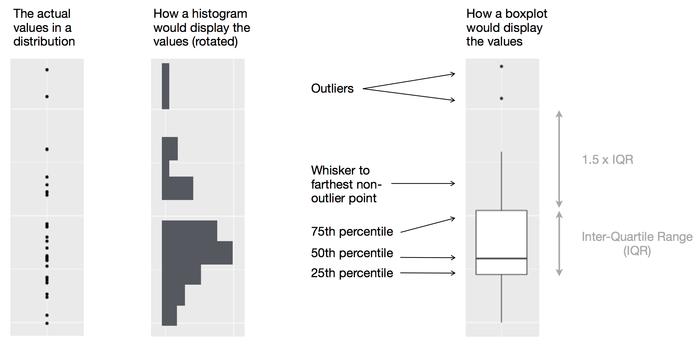

```{r setup, include=FALSE}
options(width = 65)
library(tidyverse)
knitr::opts_chunk$set(cache = TRUE)
```

# Admin

- Lecturer information

  ```html
  Dr. Haziq Jamil
  Assistant Professor in Statistics
  Room M1.09
  haziq.jamil@ubd.edu.bn
  ```

- Three classes scheduled:

  - Wed 4/3 0800-1000 @ FSM 2.17
  - Thu 5/3 1000-1200 @ FSM 2.17
  - Sat 7/3 0800-1100 @ FSM 2.17

- Slides and materials are available from my website.

- Please download RStudio.

---

Prerequisite--install tidyverse.
Examples of EDA?
importing data.
discrete vs continuous.

common issues (too many variables? confused? don't know what the question is?)

---

.center[]

---


---

# Two kinds of data science

- Type I Data Scientist

  - Knows a lot about Data Science techniques or technologies. 
  - Has a deep knowledge of their topic/domain of interest.
  - Able to highlight details and patterns in the data.
  - **"Exploratory Data Analysis"**

--

- Type II Data Scientist

  - Focus on business goals and problems.
  - Solves problems with data-based evidence.
  - Good communicators and story tellers.
  - **"Statistical Modelling and Inference"**

--

.footnote[
----
Categorisations are not my own. See this [blog post](https://brendantierneydatamining.blogspot.com/2013/03/type-i-and-type-ii-data-scientists.html) by B Tierney. It seems that Data Science as a subject continues to evolve to this day.
]


---
layout: true

# Exploratory Data Analysis

---
.center[.large[You are given a data set, what do you do first?]]

--

- EDA is a systematic way of manipulating, transforming, and visualising data.

- It is an iterative cycle.

- One objective in mind: **Generate many promising leads that you can later explore in more depth**.

--

.center[.large[There are no strict rules to follow—investigate every idea!]]

---


.center[.large[EDA is an important part of any data analysis, even if the questions are handed to you on a platter.]]

EDA involves:

- Data cleaning

- Looking at patterns

- Asking questions / forming hypotheses

---
layout: false

# Asking questions

1. What type of variation occurs within my variables?

2. What type of covariation occurs between my variables?

--

- A **variable** is a quantity, quality, or property that you can measure.

- A **value** is the state of a variable when you measure it. The value of a variable may change from measurement to measurement. 

- An **observation** (or a sample) is a set of measurements made under similar conditions.

---

# Variation

.center[.large[Variation is the tendency of the values of a variable to change from measurement to measurement.]]

- Measurement of **continuous variables** can vary from one observation to another due to many factors (e.g. random noise, measurement error, etc.)&mdash;Even if they are supposedly constant (e.g. gravity, speed of light, molar mass constant, etc.)

- **Categorical variables** (i.e. discrete variables) can also vary if you measure across different subjects (e.g. the eye colors of different people), or different times (e.g. the energy levels of an electron at different moments). 

--

.center[.large[No variation = no information (boring!). We are interested to see *patterns* of variation in each variable, which can reveal interesting information.]]

---

# Install `tidyverse` package

Before we begin, install the `tidyverse` package

```{r, eval = FALSE}
install.packages("tidyverse")
```

Contains a bunch of useful packages to help us do data science. Check out 
https://www.tidyverse.org for more details.

Most examples are based on this book: https://r4ds.had.co.nz 

---


# Fuel economy data set

Fuel economy data from 1999 and 2008 for 38 popular models of car ( $n$ =234, $p$ = 11).

```{r}
mpg
```

Type `?mpg` in R to learn more about this data set (or any function of R!).

---
layout:true 

# 5-number summary

---

The five-number summary is a set of descriptive statistics that provides information about a dataset. It consists of the five most important sample percentiles:

1. The sample minimum 
2. The lower quartiles (Q1, 25%)
3. The median (Q2, 50%)
4. The upper quartile (Q3, 75%)
5. The sample maximum 

--

This is a concise way of summarising the **distribution** (i.e. spread) of the data set (without plotting).

.center[.large[Beware of the flaw of averages!]]

---

.center[]

---

```{r}
summary(mpg)
```

---
layout:false  

# Frequency tables

.center[.large[Notice that R gives the 5-number summary for **continuous variables** only]]

- Obviously, it is not possible to calculate the summary statistics of categorical variables.

- For categorical variables: one way of summarising it is using frequency tables.

```{r}
table(mpg$drv)
```

- Later we'll see covariation between two categorical variables and how to tabulate this.


---
layout: false

# Visualisation

How you visualise the distribution of a variable will depend on whether the variable is categorical or continuous. 

### Continuous

- Box & Whisker plot
- Histogram
- Smoothed density plot

### Categorical

- Bar plots

---

# Histogram

```{r histplot, fig.width = 6, fig.height = 2.2, out.width = "800px", message = FALSE}
summary(mpg$hwy)
ggplot(data = mpg) +
  geom_histogram(mapping = aes(x = hwy))
```

---

# Histogram

```{r histplot2, fig.width = 6, fig.height = 2.2, out.width = "800px", message = FALSE}
summary(mpg$hwy)
ggplot(data = mpg) +
  geom_histogram(mapping = aes(x = hwy), binwidth = 5)
```

---

# Histogram

```{r histplot3, fig.width = 6, fig.height = 2.2, out.width = "800px", message = FALSE}
summary(mpg$hwy)
ggplot(data = mpg) +
  geom_histogram(mapping = aes(x = hwy), binwidth = 0.5)
```


---

# Smoothed density plot

```{r densplot, fig.width = 6, fig.height = 2.2, out.width = "800px", message = FALSE}
summary(mpg$hwy)
ggplot(data = mpg) +
  geom_density(mapping = aes(x = hwy))
```

---

# Histogram with smoothed density plot

```{r histdensplot, fig.width = 6, fig.height = 2.9, out.width = "800px", message = FALSE}
ggplot(data = mpg) +
  geom_histogram(mapping = aes(x = hwy, y = stat(density)),
                 binwidth = 5) +
  geom_density(mapping = aes(x = hwy), col = "red", size = 1)
```

---
layout: true

# Box & Whisker plot

---


```{r bwplot, fig.width = 6, fig.height = 2.2, out.width = "800px"}
summary(mpg$hwy)
ggplot(data = mpg) +
  geom_boxplot(mapping = aes(y = hwy))
```

---

.center[]

---

```{r bwplot2, fig.width = 6, fig.height = 3.2, out.width = "800px"}
ggplot(data = mpg, mapping = aes(y = hwy, x = 0)) +
  geom_boxplot() +
  geom_point()
```

---

```{r bwplot3, fig.width = 6, fig.height = 3.2, out.width = "800px"}
ggplot(data = mpg, mapping = aes(y = hwy, x = 0)) +
  geom_boxplot() +
  geom_jitter(width = 0.3)
```

---
layout: false

# Bar plot

.center[.large[Use for **discrete variables** only! This is not the same as a histogram!]]

```{r barplot, fig.width = 6, fig.height = 2.5, out.width = "800px"}
ggplot(data = mpg) +
  geom_bar(mapping = aes(x = class))
```

---
layout: true

# Covariation

---

If variation describes the behavior within a variable, covariation describes the behavior between variables. Covariation is the tendency for the values of two or more variables to vary together in a related way.

---

### Continuous vs continuous variables

- Scatter plot
- Smoothed lines

### Continuous vs categorical variables

- Box & whisker 
- Faceting
- Additional aesthetic mappings

### Categorical vs categorical variables

- Count plots
- Heat maps

---
layout: false

# Scatter plot

```{r scatter, fig.width = 6, fig.height = 3.2, out.width = "800px"}
ggplot(data = mpg) +
  geom_point(mapping = aes(x = displ, y = hwy))
```

---
layout: true

# Smoothed line

---

```{r smoothline, fig.width = 6, fig.height = 3.2, out.width = "800px", message = FALSE}
ggplot(data = mpg, mapping = aes(x = displ, y = hwy)) +
  geom_point() +
  geom_smooth()
```

---

```{r smoothline2, fig.width = 6, fig.height = 3.2, out.width = "800px", message = FALSE}
ggplot(data = mpg, mapping = aes(x = displ, y = hwy)) +
  geom_point() +
  geom_smooth(se = FALSE)
```

---

```{r smoothline3, fig.width = 6, fig.height = 3.2, out.width = "800px", message = FALSE}
ggplot(data = mpg, mapping = aes(x = displ, y = hwy)) +
  geom_point() +
  geom_smooth(se = FALSE, method = "lm")
```

---
layout: false

# Box & Whisker

```{r bwplot4, fig.width = 6, fig.height = 3.2, out.width = "800px"}
ggplot(data = mpg) +
  geom_boxplot(mapping = aes(y = hwy, x = class)) +
  labs(y = "Highway miles per gallon", x = "Vehicle type")
```

---

# Faceting

```{r smoothlinefacet, fig.width = 6, fig.height = 3.1, out.width = "800px", message = FALSE, warning = FALSE}
ggplot(data = mpg, mapping = aes(x = displ, y = hwy)) +
  geom_point() +
  geom_smooth(se = FALSE, method = "lm") +
  facet_wrap(~ class, nrow = 2)
```

---
layout: true

# Additional aesthetics

---

```{r addaes, fig.width = 6, fig.height = 3.1, out.width = "800px", message = FALSE, warning = FALSE}
ggplot(data = mpg, mapping = aes(x = displ, y = hwy, col = class)) +
  geom_point()
```

---

```{r addaes2, fig.width = 6, fig.height = 3.1, out.width = "800px", message = FALSE, warning = FALSE}
ggplot(data = mpg, mapping = aes(x = displ, y = hwy, col = class)) +
  geom_point() +
  geom_smooth(se = FALSE, method = "lm")
```

---
layout: false

# Contingency tables

Recall the frequency table earlier? We can also do it for two categorical variables.

```{r}
table(mpg$class, mpg$cyl)
```


---

# Count plot

```{r countplot, fig.width = 6, fig.height = 3.1, out.width = "800px", message = FALSE, warning = FALSE}
ggplot(data = mpg) +
  geom_count(mapping = aes(x = class, y = cyl))
```

---

# Heatmap


```{r heatmap, fig.width = 6, fig.height = 3, out.width = "800px", message = FALSE, warning = FALSE}
dat <- reshape2::melt(table(mpg$class, mpg$cyl),
                      var = c("class", "cyl"))
ggplot(data = dat) +
  geom_tile(mapping = aes(x = class, y = cyl, fill = value)) +
  scale_fill_gradient(low = "white", high = "blue")
```

---
class: inverse, middle, center

# Example 1: Titanic survival data

---

# Load the data

```{r, eval = FALSE}
library(readr)
titanic <- read_csv("titanic.csv")
```

.center[]

---
layout: true 

# Look at the dataset

---

```{r, eval = FALSE}
titanic  # or type View(titanic)
```

```{r, echo = FALSE}
titanic
```

Or just double-click the object 'titanic' from the environment window.

---

Can also subset some variables:

```{r}
titanic[, c("Ticket", "Fare", "Cabin", "Embarked")]
```


---
layout: true

# What are we thinking?

---

As a data scientist, you should be curious about how the data set looks like. 
- How many columns (variables) were measured?
- How many rows (instances or samples) are available?
- What kind of variables are there?
- Are there any missing values?
- Do I need to clean it?
- Do I understand what the variables mean? (is there a codebook/data dictionary?)

--

A great data scientist will also mould his state of mind to immerse themselves fully in the data.
- What day/month/year did the Titanic sail for its last journey?
- What were the ports of call?
- What was the public mood surrounding the Titanic?

---

.pull-left[]

.pull-right[
Data obtained from https://www.kaggle.com/c/titanic  

Check where you obtained your data for the data dictionary.
]
---

Often, we can get an immediate idea of what to do by just looking at the shape of the data and what's available. 

```{r}
unlist(lapply(titanic, class))
```

Let's try ask some questions of the data.

--

- How many passengers survived?
- What is the distribution of passenger class?
- What's the average age of passengers?
- Any difference in survival rates among other variables?

---
layout: true

## How many passengers survived?

---

```{r, fig.width = 6, fig.height = 3, out.width = "800px", message = FALSE, warning = FALSE}
table(titanic$Survived)

# Convert to factor (i.e. categorical variables)
titanic$Survived <- factor(titanic$Survived)
levels(titanic$Survived) <- c("No", "Yes")
table(titanic$Survived)
```

---

```{r, fig.width = 6, fig.height = 3.2, out.width = "800px", message = FALSE, warning = FALSE}
ggplot(titanic, aes(x = Survived)) +
  geom_bar()
```

---

```{r, fig.width = 6, fig.height = 3.2, out.width = "800px", message = FALSE, warning = FALSE}
ggplot(titanic, aes(x = Survived, fill = Survived)) +
  geom_bar()
```

---

```{r, fig.width = 6, fig.height = 2.8, out.width = "800px", message = FALSE, warning = FALSE}
ggplot(titanic, aes(x = Survived, fill = Survived)) +
  geom_bar() +
  geom_text(aes(label = ..count..), stat = "count", vjust = -0.5) +
  scale_y_continuous(limits = c(0, 600)) +
  theme_bw() +
  theme(legend.position = "none")
```


---
layout: false

## What is the proportion that survived?

```{r, fig.width = 6, fig.height = 2.5, out.width = "800px", message = FALSE, warning = FALSE}
ggplot(titanic, aes(x = Survived, fill = Survived,
                    y = ..count.. / sum(..count..))) +
  geom_bar() +
  geom_text(aes(label = scales::percent(..count.. / sum(..count..))), 
            stat = "count", vjust = -0.5) +
  scale_y_continuous(labels = scales::percent, name = "Proportion", 
                     limits = c(0, 0.7)) +
  theme_bw() +
  theme(legend.position = "none")
```

---
layout: true

## Distribution of passenger class

---

```{r}
table(titanic$Pclass)

# Convert to factor (i.e. categorical variables)
titanic$Pclass <- factor(titanic$Pclass)
levels(titanic$Pclass) <- c("First", "Second", "Third")
table(titanic$Pclass)

# Proportions
table(titanic$Pclass) / length(titanic$Pclass)
```

---

```{r, fig.width = 6, fig.height = 3, out.width = "800px", message = FALSE, warning = FALSE}
ggplot(titanic, aes(x = Pclass, fill = Pclass)) +
  geom_bar() +
  labs(x = "Passenger class", y = "Count") +
  theme_bw() +
  theme(legend.position = "none")
```

---

```{r, fig.width = 6, fig.height = 2.4, out.width = "800px", message = FALSE, warning = FALSE}
ggplot(titanic, aes(x = Pclass, y = 0)) +
  geom_count() +
  labs(x = "Passenger class") +
  theme_bw() +
  theme(legend.position = "none", axis.text.y = element_blank(),
        axis.title.y = element_blank())
```

Not a good plot!

---
layout: true

## Passenger class vs survival

---

```{r, fig.width = 6, fig.height = 3, out.width = "800px", message = FALSE, warning = FALSE}
table(titanic$Survived, titanic$Pclass)

df <- reshape2::melt(table(titanic$Survived, titanic$Pclass),
                     var = c("Survived", "Pclass"))
df$prop <- df$value / nrow(titanic)  # Calculate proportions
df
```

---

```{r, fig.width = 6, fig.height = 3.4, out.width = "800px", message = FALSE, warning = FALSE}
ggplot(df, aes(x = Pclass, y = value, fill = Survived)) +
  geom_bar(stat = "identity", position = "dodge")
```

---

```{r, fig.width = 6, fig.height = 2.7, out.width = "800px", message = FALSE, warning = FALSE}
ggplot(df, aes(x = Pclass, y = prop, fill = Survived)) +
  geom_bar(stat = "identity", position = "fill") +
  geom_text(aes(label = scales::percent(prop)), 
            position = position_fill(vjust = 0.5)) +
  scale_y_continuous(labels = scales::percent) +
  labs(x = "Passenger class", y = "Proportion") +
  theme_bw()
```

---
layout: true

## Distribution of age of passengers

---

```{r, fig.width = 6, fig.height = 3.4, out.width = "800px", message = FALSE, warning = FALSE}
ggplot(titanic, aes(x = Age, y = stat(density))) +
  geom_histogram() +
  geom_line(stat = "density", col = "blue", size = 1)
```

---


```{r, fig.width = 6, fig.height = 3.4, out.width = "800px", message = FALSE, warning = FALSE}
ggplot(titanic, aes(x = Age, y = stat(density), group = Survived, 
                    fill = Survived)) +
  geom_histogram() 

```

---

```{r, fig.width = 6, fig.height = 3.3, out.width = "800px", message = FALSE, warning = FALSE}
ggplot(titanic, aes(x = Age, y = stat(density), group = Survived, 
                    col = Survived, fill = Survived)) +
  geom_line(stat = "density", size = 1)
```

---

```{r, fig.width = 6, fig.height = 2.9, out.width = "800px", message = FALSE, warning = FALSE}
ggplot(titanic, aes(x = Age, y = stat(density), group = Survived, 
                    fill = Survived)) +
  geom_histogram() + 
  geom_line(stat = "density", size = 1) +
  facet_grid(Survived ~ .) +
  theme(legend.position = "none")
```

---
layout: false

# Wrap up

- EDA is "the first thing you do when data falls onto your lap"
- You should get a feel for the data, poke around, and ask questions.
- Visual tools aid in formulating relevant hypotheses surrounding the data.

NEXT TIME: How do we know the differences are significant? We will look at hypothesis testing.

---
class: inverse, middle, center

# END


