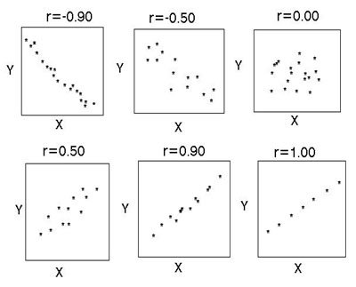

```{r setup, include=FALSE}
options(width = 65)
library(tidyverse)
library(openintro)
library(memisc)
knitr::opts_chunk$set(cache = TRUE)
```

### Linear associations

Relationship between high school graduate rate in all 50 US states and DC, and % of residents who live below the poverty line.

```{r, fig.width = 6, fig.height = 3, out.width = "800px", message = FALSE, warning = FALSE, echo = FALSE}
povdat <- readr::read_csv("poverty.csv")
ggplot(povdat, aes(x = hs_grad, y = poverty)) +
  geom_point() +
  labs(x = "% High school graduates", y = "% in poverty") +
  theme_bw() 
```

--

Key terms: Response, explanatory, relationship, correlation.

---
layout: true

## Quantifying the relationship

---

- Correlation describes the strength of the linear association between two variables.

- It takes values between -1 (perfect negative) and 1 (perfect positive).

- A value of 0 indicates no linear association.

- Usually denoted by symbol $\rho$ (or $r$)

$$
\rho = \frac{Cov(X,Y)}{\sqrt{Var(X)Var(Y)}}
$$

```{r}
cor(povdat$poverty, povdat$hs_grad)
```

---

.center[]


---
layout: false

## Eyeballing the line

Which line passes "the best" through all data points?

```{r, fig.width = 6, fig.height = 3.5, out.width = "800px", message = FALSE, warning = FALSE, echo = FALSE}
povdat <- readr::read_csv("poverty.csv")
ggplot(povdat, aes(x = hs_grad, y = poverty)) +
  geom_point() +
  geom_abline(slope = -0.09, intercept = 25, size = 1, col = "green") +
  geom_abline(slope = -0.3, intercept = 40, size = 1, col = "red") +
  geom_abline(slope = -1.4, intercept = 135, size = 1, col = "yellow") +
  geom_smooth(method = "lm", se = FALSE) +
  labs(x = "% High school graduates", y = "% in poverty") +
  theme_bw() 
```

---

## Equation of a line

The equation of a line in two dimensions is

$$
y = \beta_0 + \beta_1x 
$$

It is "parameterised" by
- an intercept $\beta_0$; and
- a slope $\beta_1$.

--

In the previous example, the $y$ variable (response) is the '% in poverty', whereas the $x$ variable (explanatory) is the '% high school graduates'.

--

Obviously, the line itself does not pass through all the data points (because of imperfections).
These imperfections are known as errors.
So perhaps the "best line" to fit is the line which gives as small an error as possible.

---
layout: true

## Least squares regression

---

Define the "residuals" or "errors", as the difference between the value of the data points, and the fitted line:
$$
\epsilon_i = y_i - (\beta_0 + \beta_1 x_i)
$$
--

Then, the method of least squares aims to find values $\beta_0$ and $\beta_1$ which minimises

\begin{gather}
\sum_{i=1}^n \epsilon_i^2 = \sum_{i=1}^n  (y_i - \beta_0 - \beta_1 x_i)^2
\end{gather}

---
 
GOAL: "Adjust" the blue line (regression slope and intercept) such that the red lines (errors) are as small as possible"

```{r, fig.width = 6, fig.height = 3.4, out.width = "800px", message = FALSE, warning = FALSE, echo = FALSE}
# as_tibble(openintro::countyComplete) %>% 
#   group_by(state) %>% 
#   select(poverty, hs_grad, home_ownership, median_household_income) %>% 
#   summarise(poverty = mean(poverty), hs_grad = mean(hs_grad),
#             home_ownership = mean(home_ownership),
#             median_household_income = mean(median_household_income)) -> povdat
povdat <- readr::read_csv("poverty.csv")
mod <- lm(poverty ~ hs_grad, povdat)
dat <- povdat
dat$yhat <- fitted(mod)
ggplot(dat, aes(x = hs_grad, y = poverty)) +
  geom_point() +
  geom_smooth(method = "lm", se = FALSE) +
  geom_segment(aes(x = hs_grad, xend = hs_grad, y = poverty, yend = yhat),
               col = "red") +
  labs(x = "% High school graduates", y = "% in poverty") +
  theme_bw() 
```

---

```{r}
# povdat <- readr::read_csv("poverty.csv") # load data set first
povdat
```


---

```{r}
mod <- lm(formula = poverty ~ hs_grad, data = povdat)
summary(mod)
```

---

```{r}
fitted(mod)
```

---

```{r, fig.width = 6, fig.height = 3.4, out.width = "800px", message = FALSE, warning = FALSE}
qplot(x = povdat$hs_grad, y = fitted(mod), geom = "line") +
  geom_point(data = povdat, aes(x = hs_grad, y = poverty))
```

---
layout:false 

class: inverse, middle, center

## The technical stuff

---

### Key assumptions in linear regression model

The (simple) linear regression model is

\begin{gather}
y_i = \beta_0 + \beta_1x_i + \epsilon_i \\
\epsilon_i \sim N(0,\sigma^2)
\end{gather}

in words: "each observed value can be explained by a regression line, plus a random noise"

--

In addition to this, several assumptions are made:

- The explanatory variables are fixed (non-random).
- The errors are independent and identically distributed (normally distributed).
- Different values of the response variables have the same variance in their errors (homoscedasticity).

https://towardsdatascience.com/assumptions-of-linear-regression-algorithm-ed9ea32224e1
 
---
 
## The Modelling Process

.center[]

- **MODEL**: Which explanatory variable(s) should I include? What relationship do I hypothesise between them?
- **FIT**: Run this model in R (or other software packages)
- **DIAGNOSE**: Any assumptions violated? Any variables not significant?

Important to have a solid model for inference. **Remember: Garbage In Garbage Out**.

---
layout: true

## Checking assumptions

---

1) Look at error patterns by plotting it against fitted values, response, explanatory variables, etc.

.center[]

*"Different values of the response variables have the same variance in their errors (homoscedasticity)"*

---

```{r, fig.width = 6, fig.height = 3.5, out.width = "800px", message = FALSE, warning = FALSE}
plot(mod, which = 1)
```

---

```{r, fig.width = 6, fig.height = 3.4, out.width = "800px", message = FALSE, warning = FALSE}
ggplot(mod, aes(.fitted, .resid)) +
  geom_point() 
```

---


```{r, fig.width = 6, fig.height = 3.4, out.width = "800px", message = FALSE, warning = FALSE}
ggplot(mod, aes(.fitted, .resid)) +
  geom_point() + geom_smooth(se = FALSE)
```

---

2) Check normality assumptions&mdash;histogram and Q-Q plot of residuals

```{r, fig.width = 6, fig.height = 3, out.width = "800px", message = FALSE, warning = FALSE}
ggplot(mod, aes(.resid)) +
  geom_histogram(binwidth = 1)
```

---


```{r, fig.width = 6, fig.height = 3.4, out.width = "800px", message = FALSE, warning = FALSE}
ggplot(mod, aes(sample = .resid)) +
  geom_qq() + geom_qq_line()
```

---

```{r, fig.width = 6, fig.height = 3.4, out.width = "800px", message = FALSE, warning = FALSE}
plot(mod, which = 2)
```

---
layout: true

# Tests of significance

---

For the estimated values of $\beta_0$ and $\beta_1$, how do we know the values obtained are "significant"? I.e., how do we know the actual regression line is not:
- $y = \beta_0$ only (slope is zero)?
- $y = \beta_1x$ only (intercept is zero)?
- $y = 0$ (both slope and intercept are zero)?

--

Luckily, each estimate $\hat\beta_k$ of $\beta_k$ has a (asymptotically) normal distribution:
$$
\hat\beta_k \sim N(\beta_k, SE(\hat\beta_k))
$$
So it is possible to perform statistical tests based on this distribution.

---

*Example: Testing the significance of the slope parameter $\beta_1$.*

\begin{align*}
H_0:& \beta_1 = 0 \\
H_1:& \beta_1 \neq 0
\end{align*}

--

The $p$-value is calculated as $P(|Z|> \hat\beta_k/SE(\hat\beta_k))$, where $Z\sim N(0,1)$. Reject $H_0$ for small values of $p$ (usually less than $\alpha=0.05$).

--

```{r, eval = FALSE}
summary(mod)
## Coefficients:
##             Estimate Std. Error t value Pr(>|t|)    
## (Intercept) 76.85835    5.62054   13.68  < 2e-16 ***
## hs_grad     -0.73662    0.06621  -11.12 5.19e-15 ***
## ---
## Signif. codes:  0 ‘***’ 0.001 ‘**’ 0.01 ‘*’ 0.05 ‘.’ 0.1 ‘ ’ 1
```

--
 
Note: it is actually a $t$-test, but for large samples doesn't matter too much as $t_{n-1}\to N(0,1)$.

---
layout:false 

# Coefficient of determination

The $R^2$ value, calculated as
\begin{align}
R^2 = 1 - \frac{\text{Residual S.S.}}{\text{Total S.S.}} = 1- \frac{\sum_{i=1}^n (y_i - \hat y_i)^2}{\sum_{i=1}^n ( y_i - \bar y)^2} \in [0,1]
\end{align}

It is the proportion of the variation in the data that is explained by the model.
Values closer to 1 indicate "a better model agreement".

--

Note that the "Adjusted $R^2$" may also be reported or used, but this is virtually the same thing.

--
```{r, eval = FALSE}
summary(mod)
## Residual standard error: 2.068 on 49 degrees of freedom
## Multiple R-squared:  0.7164,	Adjusted R-squared:  0.7106 
## F-statistic: 123.8 on 1 and 49 DF,  p-value: 5.195e-15
```

---

layout: true

# Binary variables

---

Consider again the `mpg` data set. Any difference in consumption of high vs low displacement engines?

```{r}
mpg
```

---

Create a new binary variable to distinguish between vehicles that are low displacement ( $\leq 2$ cc engines) and high displacement ( $>2$ cc engines).

```{r}
(mpg$cc <- as.numeric(mpg$displ > 2))
```

The variable `cc` equals 0 when it is low displacement, and 1 when it is high displacement.

---

Think about the relationship between city mileage (`cty`) and this new variable `cc` from a linear regression standpoint.
\begin{align*}
y_i = \beta_0 + \beta_1x_i + \epsilon_i
\end{align*}

Technically

\begin{align}
y_i = \begin{cases} \beta_0 + \epsilon_i &\text{if } x_i = 0 \\
\beta_0 + \beta_1 + \epsilon_i &\text{if } x_i = 1 \end{cases}
\end{align}

So we are using a regression framework to estimate two kinds of means (one for low displacement $\beta_0$ and one for high displacement $\beta_0+\beta_1$).

---

```{r}
summary(lm(cty ~ cc, mpg))
```

---

The regression fitted is

\begin{align}
\hat y_i = \begin{cases} 22.3  &\text{if } x_i = 0 \\
22.3 -6.72 =15.58  &\text{if } x_i = 1 \end{cases}
\end{align}

--

In other words, the average city mileage is 22.3 for low displacement cars, and 15.6 for high displacement cars. Makes sense&mdash;larger engines are less efficient!

--

Note that the $p$-value for $\beta_1$ is $<0.05$, so is is significant. Meaning that there is a significant difference between the two kinds of means.

---

Compare this to a $t$-test

```{r}
t.test(cty ~ cc, mpg, var.equal = TRUE)
```

--

This gives the exact same value for the test statistic ($T=11.83$), $p$-value and means that are estimated!


---
layout:false 

class: inverse, middle, center

# Multiple regression

---

## Adding more explanatory variables

Back to the poverty data set again.

```{r}
povdat
```

We can build a model to explain poverty on several explanatory variables.


---

```{r}
mod1 <- lm(poverty ~ hs_grad + home_own + median_income + party_maj, povdat)
summary(mod1)
```

---

## Model selection

Notice that the coefficient associated with `party_maj` is not significant ( $p=0.324$). This suggests that the State's party affiliation does not explain the level of poverty very much. 

--

More precisely, everything remaining constant, the average level of poverty is practically the same regardless of state party affiliation.

--

Let's remove this variable and refit the model.

---

```{r}
mod2 <- lm(poverty ~ hs_grad + home_own + median_income, povdat)
summary(mod2)
```

Now all variables are significant.

---
layout: true

## Check model diagnostics

---

```{r, fig.width = 6, fig.height = 3.4, out.width = "800px", message = FALSE, warning = FALSE}
plot(mod2, which = 1)
```

---


```{r, fig.width = 6, fig.height = 3.4, out.width = "800px", message = FALSE, warning = FALSE}
plot(mod2, which = 2)
```

---

The diagnostic plots look OK, but it seems there might be an outlier. 
The model does not seem to be explaining data point 12 very well.

```{r}
apply(povdat[, -c(1, 6)], 2, mean)  # mean values
povdat[12, ]
```

--

Two options: 1) EXPLAIN or 2) REMOVE. Further reading: https://towardsdatascience.com/ways-to-detect-and-remove-the-outliers-404d16608dba

---
layout: true

## Back to model selection

---

Here's a comparison of `mod`, `mod1` and `mod2`

```{r, results = "asis", echo = FALSE}
format(mtable(mod, mod1, mod2, summary.stats = c("sigma", "R-squared", "AIC", "BIC")), target = "HTML")
```

---

There are several criteria for selecting the "best" model
- All explanatory variables significant
- Residuals as small as possible (i.e. errors/sigma)
- $R^2$ as high as possible
- Akaike's information criterion (AIC) small as possible
- Bayesian information criterion (BIC) small as possible

--

Model comparison (or variable selection) is such a vast topic to cover, many methods exist.
Simplest one for now is to perform **Stepwise Regression**.
In a nutshell, this automatically adds and removes variables until it reaches a model with minimal AIC.

---

```{r}
step(mod1)
```

---
layout: true

## Interpreting the model

---

Two main things to describe: 1) Which variables contribute towards explaining the response variable, and 2) what is the signa and magnitude of the effect?

---

### The intercept

For this regression model:

```{HTML}
poverty = intercept + hs_grad + home_own + median_income + error
```

Suppose we have a state that has `hs_grad=0`, `home_own=0` and `median_income=0`. Then the regression becomes simply `poverty = intercept + error`.

--

In particular,

```{HTML}
E(poverty) = intercept
```

--

.center[**The intercept is the expected value of the response variable given that all other explanatory variables are zero.**]

---

### The slopes

Consider the regression function $y = \beta_0 + \beta_1x_1 + \cdots + \beta_px_p + \epsilon$. Now suppose the value of the explanatory variable $x_1$ increases by one unit, then we have

$$y' = \beta_0 + \beta_1(x_1+1) + \cdots + \beta_px_p + \epsilon$$

--

The difference between the two values is
\begin{align}
y' - y 
&= \beta_0 + \beta_1(x_1+1) + \cdots + \beta_px_p + \epsilon \\
&\hspace{2em} - (\beta_0 + \beta_1x_1 + \cdots + \beta_px_p + \epsilon) \\
&= \beta_1
\end{align}

--

**The $\beta_k$ values give the average increase in the response variable given a unit change in $x_k$**

---

```{r}
round(coef(mod2), 3)
```

Example statements:

- The expected poverty rate in a state with zero high school graduates, home ownership and income is 75%&mdash;not helpful!.
- The average values for `hs_grad` and `home_own` are 84.7 and 71.7 respectively. The expected poverty rate in a state with average high school graduate and home ownership (ignore income) is therefore 
$$
75.1  -0.451 \times 84.7        -71.7 \times 0.151  = 26.1
$$
- For every percentage increase in high school graduates, poverty rates decline by 0.451 points.
- Forevery percentage increase in home ownership, poverty rates decline by 0.151 points.

---
layout: true

## Scale

---


What's wrong with the coeficient for income? It's 0.000... is it actually zero? No. Look at the scale of the variables:

```{r}
summary(povdat)
```

Everything else in a percentage scale, while income is measured annually so goes to the tens of thousands.

---

One way to make things better is to scale the variables appropriately.
For example, we can report income in thousands.
Either we fix this at the data frame level

```{r, eval = FALSE}
povdat$median_income <- povdat$median_income / 1000
mod3 <- lm(poverty ~ hs_grad + home_own + median_income, povdat)
```

or fit a new model directly

```{r}
mod3 <- lm(poverty ~ hs_grad + home_own + I(median_income/1000), povdat)
```

--

Note that scaling **does not** affect significance of coefficients.

---

```{r}
summary(mod3)
```

---

```{r}
coef(mod3)
```

"For every one thousand increase in median income, poverty rate declines by 0.244 points"

---
layout: true

## ANOVA revisited

---

```{r}
data("PlantGrowth")
summary(PlantGrowth)
```

Study of 30 plants' growth in height. 10 subjected to Treatment A, 10 in Treatment B, and 10 control.
Are the means the same in each group? 

---

Clearly an ANOVA problem.
\begin{align}
H_0:& \ \mu_{ctrl} = \mu_A = \mu_B \\
H_1:& \text{ means are not equal}
\end{align}
--
```{r}
aggregate(weight ~ group, PlantGrowth, mean)
```
--
```{r}
summary(aov(weight ~ group, PlantGrowth))
```

---

A different way of thinking about the problem: Define "dummy" variables $x_1$ and $x_2$, whereby 
\begin{align*}
x_1 = \begin{cases}
1 &\text{if treatment 1} \\
0 &\text{otherwise}
\end{cases}
\end{align*}

\begin{align*}
x_2 = \begin{cases}
1 &\text{if treatment 2} \\
0 &\text{otherwise}
\end{cases}
\end{align*}

Now build the regression model

\begin{align*}
y = \beta_0 + \beta_1 x_{1} + \beta_2 x_{2} + \epsilon
\end{align*}

---

In other words, we have that

.center[]


The model breaks down the means of the three groups in terms of three parameters $\beta_0$, $\beta_1$ and $\beta_2$.

--

- $\beta_0$ represents the control group mean
- $\beta_1$ represents the *additional* effect of being in treatment group A
- $\beta_2$ represents the *additional* effect of being in treatment group B

---


```{r}
summary(lm(weight ~ group, PlantGrowth))
```

---

Interpretation
- $\hat\beta_0 = 5.03$ is the control group mean.
- $\beta_1$  not deemed significant, so effect of treatment 1 not found to be significant (no difference from control).
- $\beta_2$ weakly significant ( $p=0.09$). Treatment 2 found to increase the yield of plants by 0.494 grams.

Note that the $F$ statistic is identical to the ANOVA test statistic. It actually tests whether or not all $\beta_k$ values are equal to zero or not.

---
layout:false 

class: inverse, middle, center

# Logistic regression

---
layout: true

### Normality assumption

---

Revisit the titanic data set

```{r, message = FALSE}
(titanic <- readr::read_csv("titanic.csv"))
```

Let's build a model to predict survival of passengers by age.

---

Plotting the best fit line... does this make sense?

```{r, fig.width = 6, fig.height = 2.8, out.width = "800px", message = FALSE, warning = FALSE}
ggplot(titanic, aes(x = Age, y = Survived)) +
  geom_point() +
  geom_smooth(method = "lm", se = FALSE) +
  theme_bw()
```

---

Besides the weird looking graph, the **normality assumption** is violated as well.

--

PROBLEM 1: Since $y_i$ can only take two values (survived vs not-survived), it is in fact a Bernoulli distribution and not normal.

--

PROBLEM 2: You might get predicted values that are greater than 1 and less than 0.

--

Therefore the normal linear model is inadequate for this purpose.

---
layout: true

## Logistic regression
---

Let 
\begin{align*}
y_i = \begin{cases}
1 &\text{if survived} \\
0 &\text{otherwise} \end{cases}
\end{align*}
and let $\pi_i=P(y_i=1) = P(\text{survived})$. 

--

Model instead the log odds by a linear function
\begin{align*}
\log \left( \frac{\pi_i}{1-\pi_i} \right) = \beta_0 + \beta_1 x_{i1} + \cdots + \beta_p x_{ip}
\end{align*}

This is called the logistic regression.

---

```{r}
mod <- glm(Survived ~ Age, titanic, family = "binomial")
summary(mod)
```

---
layout: true

## Interpretation

---

Suppose all values of $x_{ik} =0$, we are left with the intercept. And this means that 

\begin{align*}
\log \left( \frac{\pi_i}{1-\pi_i} \right) &= \beta_0 \\
\Rightarrow \frac{\pi_i}{1-\pi_i} &= e^{\beta_0}
\end{align*}

--

The term on the left is called the **ODDS**&mdash; it expresses how likely an event is to occur rather than not occur.

--

In this example, the odds of surviving is given as $e^{-0.056}=0.94$&mdash;More likely to not survive than not survive (assume age is zero). The odds of surviving for someone who is 30 years of age (mean age) is therefore $e^{-0.056-30\times0.011}=0.67$ (it's worse!)

---

<!-- Note that the logistic regression can be expressed like this: -->

<!-- \begin{align*} -->
<!-- \pi_i = \frac{e^{\beta_0 + \beta_1 x_{i1} + \cdots + \beta_p x_{ip}}}{1 + e^{\beta_0 + \beta_1 x_{i1} + \cdots + \beta_p x_{ip}}} -->
<!-- \end{align*} -->

<!-- -- -->

For one unit increase in $x_1$, the odds ratio is
\begin{align*}
OR(x_1+1,x_1) &= \frac{e^{\beta_0 + \beta_1 (x_{i1}+1) + \cdots + \beta_p x_{ip}}}{e^{\beta_0 + \beta_1 x_{i1} + \cdots + \beta_p x_{ip}}} \\
&= e^{\beta_1}
\end{align*}

--

**This suggests that the ratio of the odds of a "successful" event is multipled by $e^{\beta_1}$ for every unit increase of $x_1$.**

--

For a passenger on the titanic, every year older decreases his odds of survival by $e^{-0.01}=0.99$.

---

```{r, fig.width = 6, fig.height = 2.8, out.width = "800px", message = FALSE, warning = FALSE}
ggplot(titanic, aes(x = Age, y = Survived)) +
  geom_point() +
  geom_smooth(method = "glm", se = FALSE, 
              method.args = list(family = "binomial")) +
  theme_bw()
```

---
layout: false

# Other notes

- For binary response variables, it's more appropriate to use logistic regression model (although you might find in practice that a normal linear model is used, especially for prediction purposes).

- Logistic regression is part of a larger family of "generalised linear models" which include Poisson count models, multinomial response models, etc.

- It's of course possible to add more explanatory variables, and also categorical/dummy variables.

- Unfortunately, diagnostics that we saw in normal linear case do not typically apply. No easy way to diagnose model. At the very least, it's possible to see the pattern of residuals, but this is not always reliable.


---
layout:false 

class: inverse, middle, center

# END


